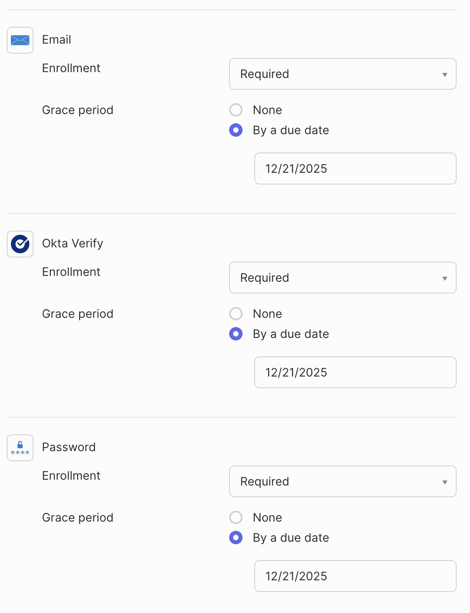
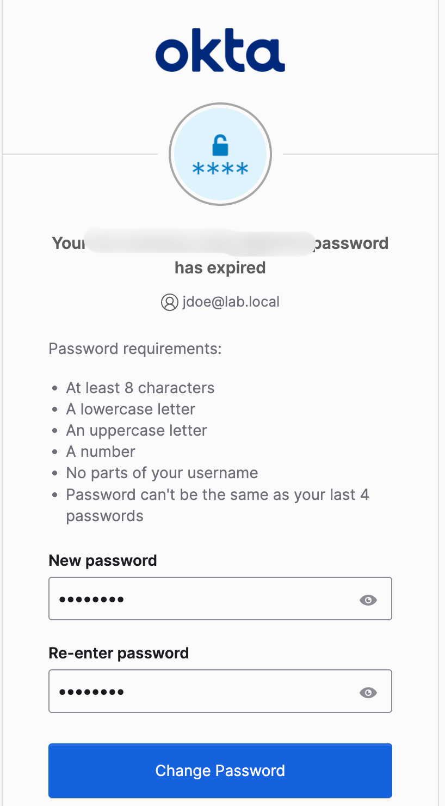
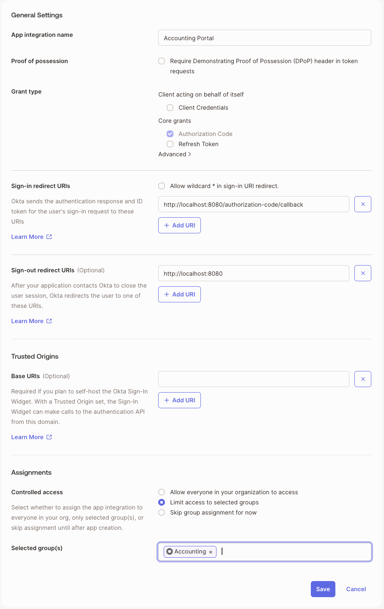
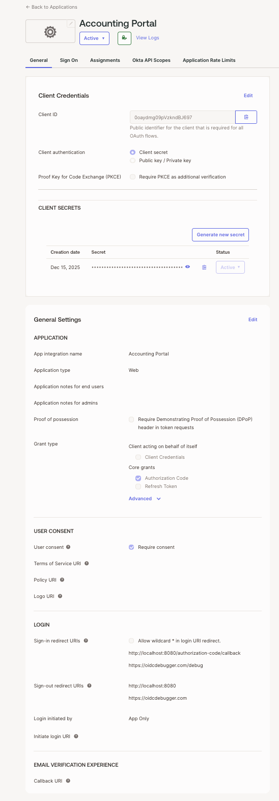
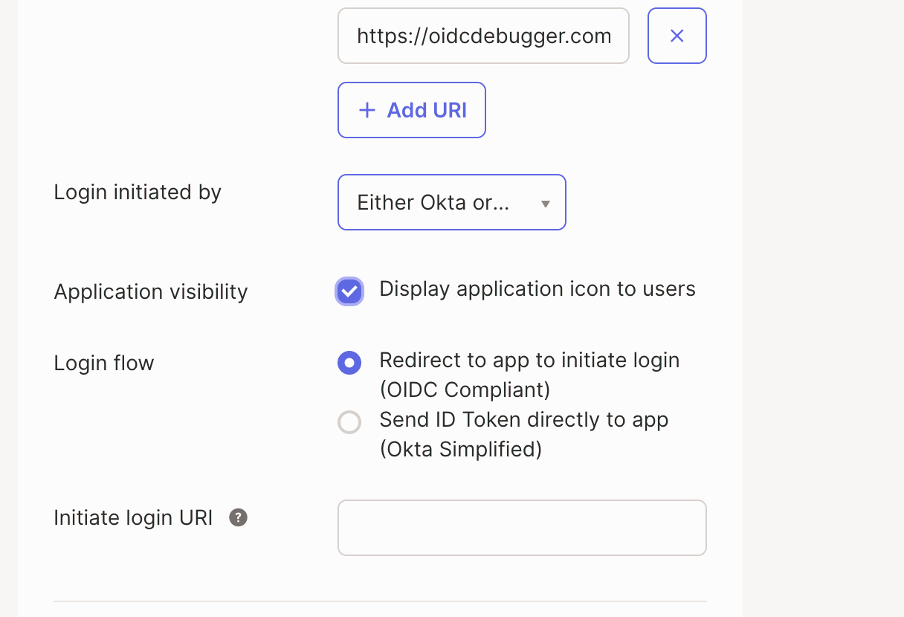
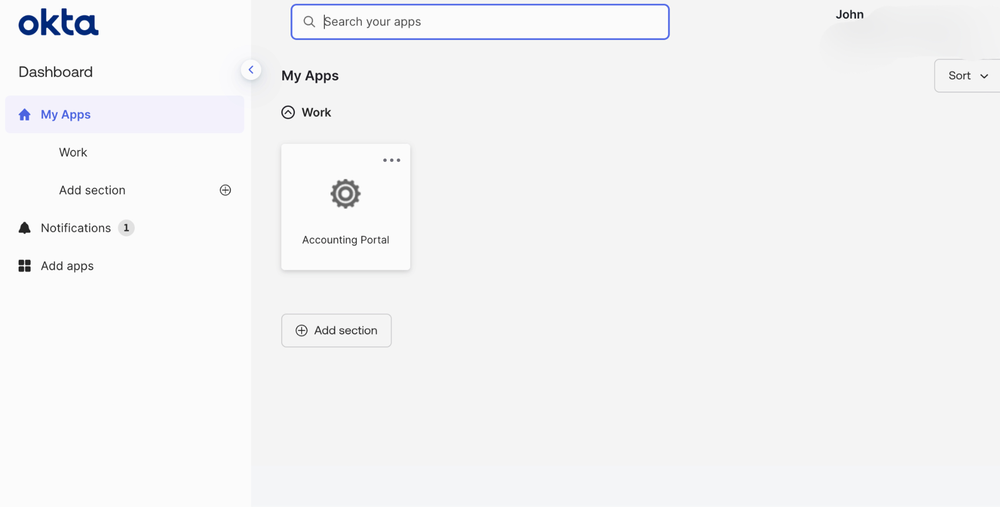

# okta-iam-lab
Hands-on Okta IAM demonstrating MFA, group-based access control, and OIDC application integration using IdP-initiated login.

## **Overview**

This project demonstrates a hands-on Identity and Access Management lab built using Okta Workforce Identity. The lab simulates how an organization manages user authentication, multi-factor authentication, and application access using group-based authorization and OpenID Connect.

The goal of this lab was to gain practical experience with real-world Okta administration workflows and document common IAM concepts such as least privilege, IdP-initiated login, and MFA enforcement.

---

## **Technologies Used**

- Okta Workforce Identity
- Okta Verify
- OIDC (OAuth 2.0 Authorization Code Flow)
- OIDC Debugger (for token inspection)

---

## **Lab Objectives**

- Configure centralized identity management using Okta
- Enforce MFA for end users
- Implement role-based access using groups
- Integrate a web application using OIDC
- Enable IdP-initiated login from Okta user dashboard
- Troubleshoot real-world application visibility issues

---

## **Identity & Access Design**

**Users**
- John Doe - Accounting User
- IT Admin - Administrative Account

**Groups**
- Accounting
- Administration

---

## **MFA Configuration**
- Password (primary factor)
- Okta Verify (secondary factor)
- Email (fallback / recovery)

MFA was enforced using Okta sign-on policies and applied to both standard users and administration.

MFA was enforced using Okta sign-on policies and applied to both standard users and administration.

Password expiration policies ensure users update credentials before accessing protected resources.

---

## **Application Integration**

**Application Details**

- **Name:** Accounting Portal
- **Type:** OIDC Web Application
- **Grant Type:** Authorization Code
- **Login Type:** IdP-initiated and App-initiated
- **Access Scope:** Accounting group only

### **Okta End-User Dashboard**

This accounting Portal application appears in the Okta end-user dashboard for users assigned to the Accounting group, confirming successful group-based access and IdP-initiated login.

## **Key Configuration**

- Application access restricted to the Accounting Group
- Admin users explicitly excluded
- Application tile displayed in the Okta End-User Dashboard
- Login initiated by Either Okta or App
- Redirects validated using OIDC Debugger

This application uses OAuth 2.0 Authorization Code flow with a confident client configuration.

---

## **Authentication Flow**

1. User signs in via Okta
2. MFA challenge enforced with Okta Verify
3. User launches the Accounting Portal from Okta dashboard
4. Okta initiates OIDC authorization
5. Tokens issued and validated via OIDC Debugger

---

## **Troubleshooting & Lessons Learned**

- Applications will not appear in the Okta dashboard if configured as App-initiated only
- IdP-initiated login requires an Initiate Login URL
- App visibility settings directly impact end-user experience
- MFA enrollment is enforced during first login when required by policy

---

## **Key Takeaways**

- Built and tested a complete IAM flow using Okta
- Gained hands-on experience with MFA, OIDC, and RBAC
- Learned how to troubleshoot common Okta misconfigurations
- Developed documentation suitable for enterprise environments

## **Additional Okta Features Reviewed**

Self-service app request settings were reviewed to understand user-driven access requests and administrative controls.

